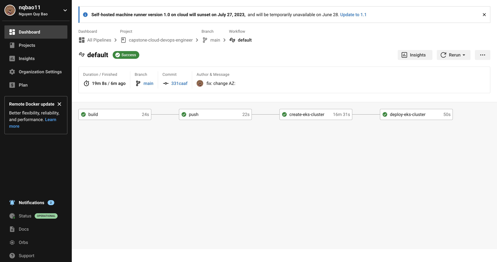
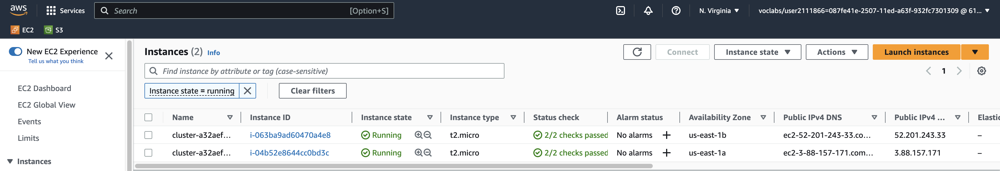
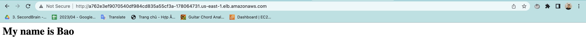
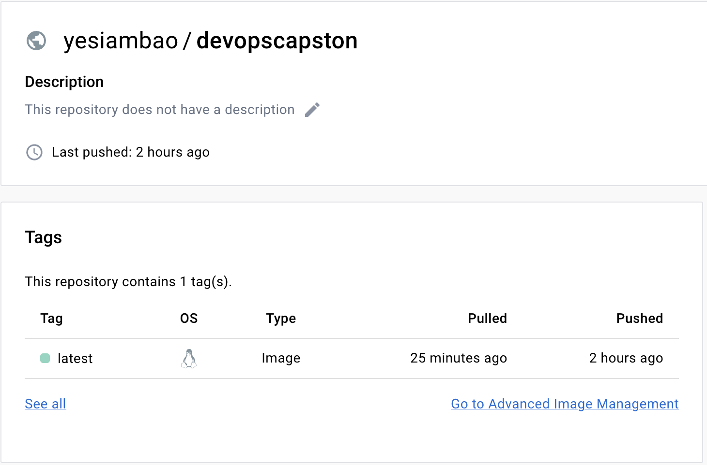
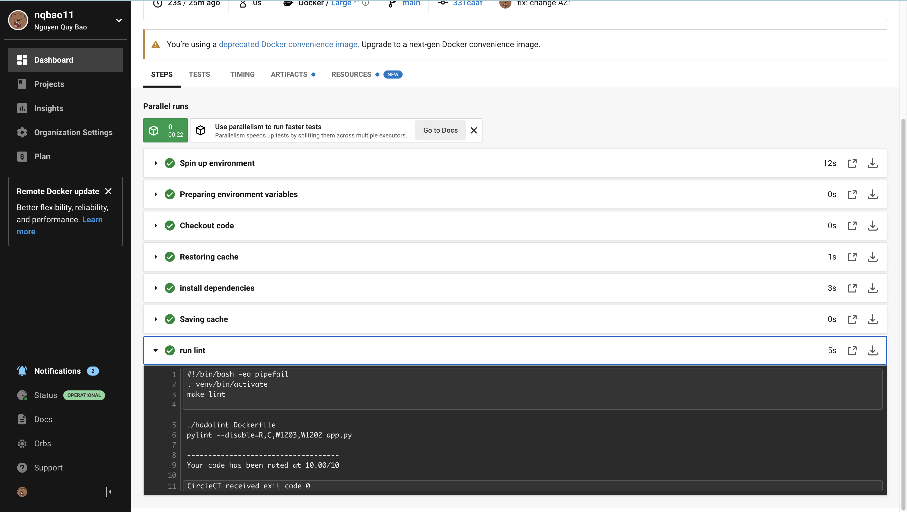
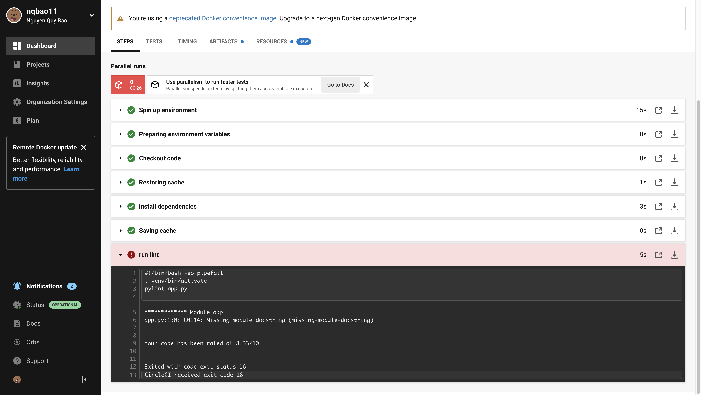

# Cloud DevOps Engineer Capstone Project

This project marks the successful culmination of the final Capstone project and the Cloud DevOps Engineer Nanodegree at Udacity.
Link github: https://github.com/nqbao11/capstone-cloud-devops-engineer

## Evidence

### 1. Circle CI passed
 

### 2. List of EC2 instance

### 3. Cloud Formation

### 4. Accessible
ELB link: http://a762e3ef9070540df984cd835a55cf3a-178064731.us-east-1.elb.amazonaws.com/

### 5. Dockerhub

### 5. Lint

